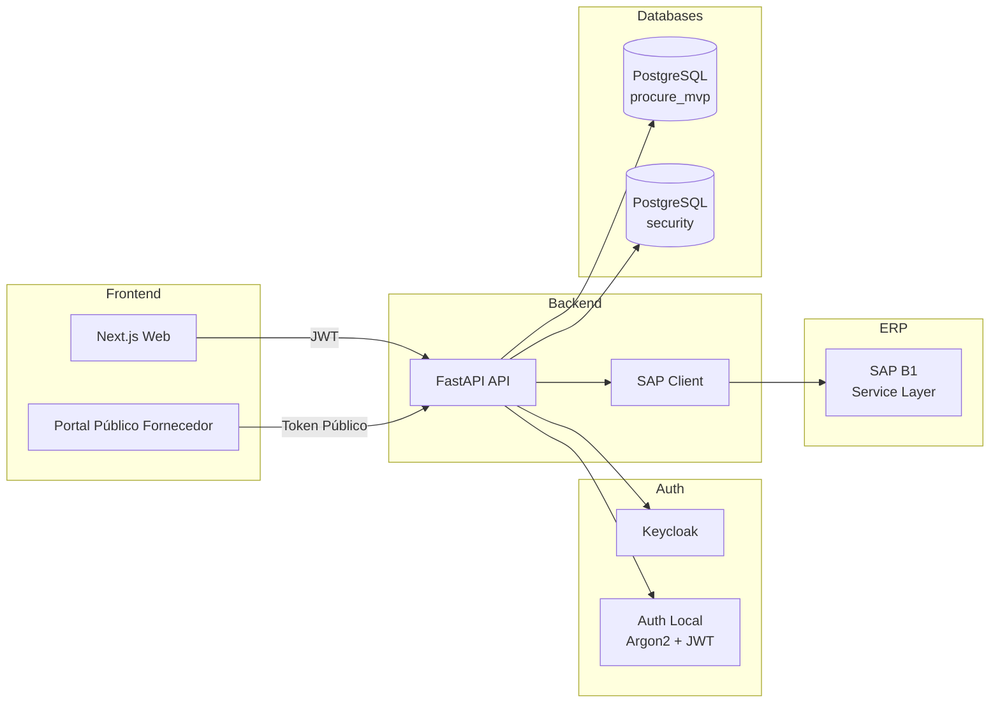
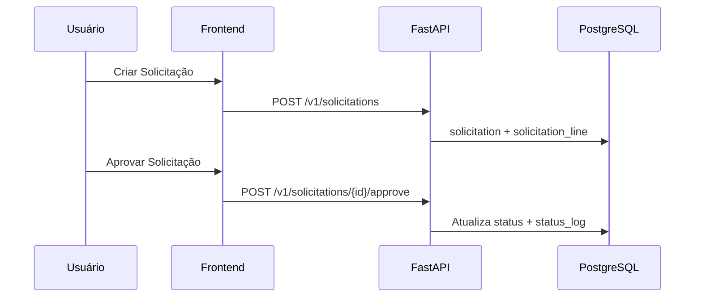
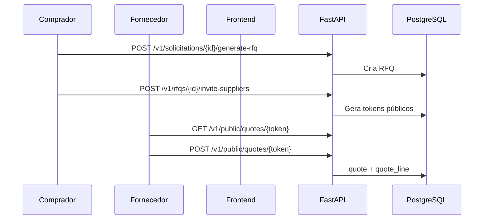
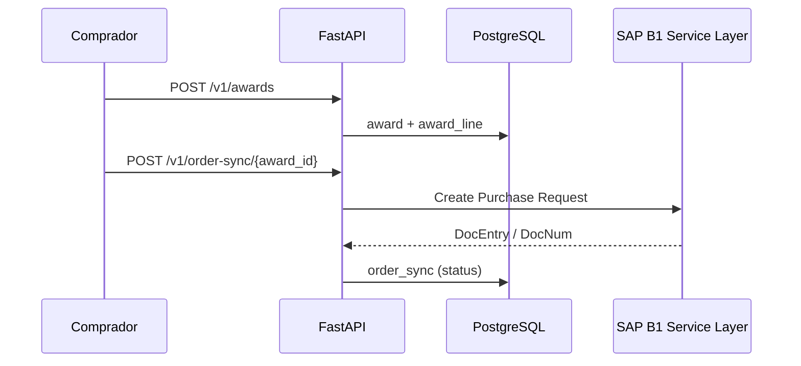

# Diagramas – Procure MVP (Solicitação & Cotação)

## Arquitetura Geral

```mermaid
flowchart LR
    subgraph Frontend
        FE[Next.js Web]
        PUB[Portal Público Fornecedor]
    end

    subgraph Auth
        KC[Keycloak]
        LOC[Auth Local<br/>Argon2 + JWT]
    end

    subgraph Backend
        API[FastAPI API]
        SAPC[SAP Client]
    end

    subgraph Databases
        DB1[(PostgreSQL<br/>procure_mvp)]
        DB2[(PostgreSQL<br/>security)]
    end

    subgraph ERP
        SAP[SAP B1<br/>Service Layer]
    end

    FE -->|JWT| API
    PUB -->|Token Público| API
    API --> DB1
    API --> DB2
    API --> SAPC --> SAP
    API --> KC
    API --> LOC
```

## Fluxo M1 – Solicitação

```mermaid
sequenceDiagram
    participant U as Usuário
    participant FE as Frontend
    participant API as FastAPI
    participant DB as PostgreSQL

    U->>FE: Criar Solicitação
    FE->>API: POST /v1/solicitations
    API->>DB: solicitation + solicitation_line

    U->>FE: Aprovar Solicitação
    FE->>API: POST /v1/solicitations/{id}/approve
    API->>DB: Atualiza status + status_log
```

## Fluxo M2 – RFQ e Cotações

```mermaid
sequenceDiagram
    participant B as Comprador
    participant F as Fornecedor
    participant FE as Frontend
    participant API as FastAPI
    participant DB as PostgreSQL

    B->>API: POST /v1/solicitations/{id}/generate-rfq
    API->>DB: Cria RFQ

    B->>API: POST /v1/rfqs/{id}/invite-suppliers
    API->>DB: Gera tokens públicos

    F->>API: GET /v1/public/quotes/{token}
    F->>API: POST /v1/public/quotes/{token}
    API->>DB: quote + quote_line
```

## Fluxo M3 – Award e Integração SAP

```mermaid
sequenceDiagram
    participant B as Comprador
    participant API as FastAPI
    participant DB as PostgreSQL
    participant SAP as SAP B1 Service Layer

    B->>API: POST /v1/awards
    API->>DB: award + award_line

    B->>API: POST /v1/order-sync/{award_id}
    API->>SAP: Create Purchase Request
    SAP-->>API: DocEntry / DocNum
    API->>DB: order_sync (status)
```
